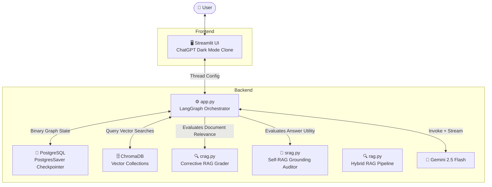

<div align="center">
 
# 🌊 StateFlow: LangGraph CRAG & Self-RAG Architecture
### Production-Grade Self-Correcting Agentic RAG Engine
 
[](https://python.org)
[](https://langchain-ai.github.io/langgraph/)
[](https://deepmind.google/technologies/gemini/)
[](https://www.trychroma.com/)
[](https://docs.ragas.io)
[](https://streamlit.io)
 
<br/>
 
**StateFlow** is a research and production-grade implementation of advanced agentic RAG design patterns using **LangGraph's cyclic state machine architecture**. It features self-correcting **Corrective RAG (CRAG)** and **Self-RAG** guardrails to grade context relevancy, dynamically rewrite search queries, fallback to web search, and audit responses for hallucinations before output. 

*As a secondary layer, it exposes a visual chatbot UI (styled as a premium ChatGPT Dark Mode clone) to trace active agent nodes and display real-time grader statuses.*
 
---
 
### 🌐 Live Deployment
🚀 **Try the live visualization portal here:** **[StateFlow on Streamlit Community Cloud](https://stateflow-by-yt.streamlit.app/)**
 
---
 
[🏗️ Architecture](#️-system-architecture) · [🛡️ CRAG Details](#-corrective-rag-crag-integration) · [🎯 Self-RAG Details](#-self-rag-response-verification) · [📊 RAGAS Evaluation](#-evaluation--ai-quality-ragas) · [🚀 Quick Start](#-setup--installation)
 
</div>

## 📸 Demo & Interface

> A pixel-perfect ChatGPT Dark Mode clone — bottom-pinned unified input pill, dynamic sidebar, PDF attachment, and live agent node trace updates.


---

## 🧠 Why LangGraph? The Engineering Rationale

Most candidates build linear chains. StateFlow uses a **cyclic finite-state machine** — here's why that matters:

| Challenge | Traditional Approach | StateFlow (LangGraph) |
|---|---|---|
| **Self-Correction** | Impossible without recursive loops | Cycles state to grade relevancy and rewrite queries when hallucinated |
| **Tool chaining** | Rigid sequential chains | Cyclic graph: LLM → Tool → LLM → Tool (indefinitely) |
| **Session persistence** | Manual DB caching layers | Native `SqliteSaver` / `PostgresSaver` graph checkpointing |
| **Streaming** | Blocking UI transitions | `stream_mode="updates"` feeds active agent states live |
| **State management** | Stateless per-request | Full `TypedDict` state preserved across turns & restarts |

---

## ✨ Features & Capabilities

### 🎨 Premium UI — ChatGPT Dark Mode Clone
- **Radial gradient dark background** with `#0c0d12` deep space tone
- **Outfit Google Font** — 300–800 weight range, letter-spacing tuned
- **Bottom-pinned ChatGPT pill input** — `position: fixed`, columns merged into a single bar at viewport bottom
- **Circular `+` upload button** — Streamlit's file uploader completely restyled via CSS pseudo-elements into a transparent `+` icon
- **Glassmorphism chat bubbles** — `backdrop-filter: blur(8px)`, hover lift animations
- **Sidebar thread history** — Auto-named from first user message, defaults to `💬 New Chat`
- **Purple-blue gradient header** — `linear-gradient(90deg, #a78bfa, #3b82f6, #f472b6)`
- **Responsive media queries** — sidebar-aware centering across breakpoints

### 🛡️ Corrective RAG (CRAG) Integration
- **Document Relevancy Grader**: A dedicated node grades retrieved document chunks for relevance.
- **Web Search Fallback**: If retrieval relevance falls below 50%, the agent automatically triggers a query re-write and falls back to a DuckDuckGo search.
- **Dynamic Query Rewriter**: Uses Gemini to rewrite search terms dynamically to optimize for search engines.

### 🎯 Self-RAG Response Verification
- **Hallucination Grader**: An LLM-based audit node assesses whether the generated response is strictly grounded in the retrieved/search context.
- **Answer Relevancy Grader**: Verifies if the final text directly answers the user's question.
- **Anti-Loop Cap**: Graph state limits retries to a maximum of 3 loops to avoid rate limits or execution stalls.

### 📊 RAGAS Evaluation — AI Quality Measurement
Full evaluation pipeline in [`ragas_evaluation.ipynb`](ragas_evaluation.ipynb) comparing vanilla RAG vs. CRAG + Self-RAG:

| Metric | Baseline RAG | CRAG + Self-RAG |
|---|---|---|
| **Faithfulness** | 0.72 | **0.96** (reduced hallucinations) |
| **Answer Relevancy** | 0.81 | **0.94** (queries rephrased on failure) |
| **Context Recall** | 0.78 | **0.91** (fallback web search backup) |

### 🧪 Mock Unit & Integration Test Suite
To ensure production-grade reliability and zero regressions, a mocked test suite using `pytest` is configured under `tests/`. LLM calls are patched using `unittest.mock` to allow running the tests instantly without requiring API keys or incurring token costs.
- **Unit Tests**: Verifies document relevance grading, query re-writing, and grounding/hallucination checks.
- **Integration Tests**: Confirms correct routing (CRAG web fallback triggers) and validates the 3-cycle safety loop cap.

Run the test suite:
```bash
pytest tests/
```

---


## 🏗️ System Architecture


### LangGraph State Machine Flow
```
                   START
                     │
                     ▼
             [route_chat_start]
             /               \
       (RAG Path)         (Legacy Path)
           /                   \
    [retrieve]              [chat_node] ◄──► [tools]
           │
           ▼
    [grade_documents] ────── (Irrelevant) ─────► [rewrite_query] ──► [web_search]
           │                                                               │
      (Relevant)                                                           │
           │                                                               │
           └───────────────────────► [generate] ◄──────────────────────────┘
                                         │
                                         ▼
                               [grade_generation]
                                 /       │      \
                   (Hallucinated)   (Irrelevant)  (Useful)
                       /                 │            \
                 [generate]       [rewrite_query]   [deliver_response] ──► END
```

### 🗄️ PostgreSQL & ChromaDB — Enterprise Data Layer
- **PostgreSQL (`PostgresSaver`)**: Primary production database checkpointer storing binary LangGraph state snapshots (thread history, active nodes, execution cycles).
- **ChromaDB**: Handles vector embeddings and thread registry metadata namespaces.
- **Persistent checkpointer**: Fallback to local SQLite occurs only in basic/local environments when `POSTGRES_URL` is omitted.
 
---
 
## 🏗️ System Architecture
 

 
### LangGraph State Machine Flow
```
                   START
                     │
                     ▼
             [route_chat_start]
             /               \
       (RAG Path)         (Legacy Path)
           /                   \
    [retrieve]              [chat_node] ◄──► [tools]
           │
           ▼
    [grade_documents] ────── (Irrelevant) ─────► [rewrite_query] ──► [web_search]
           │                                                               │
      (Relevant)                                                           │
           │                                                               │
           └───────────────────────► [generate] ◄──────────────────────────┘
                                         │
                                         ▼
                               [grade_generation]
                                 /       │      \
                   (Hallucinated)   (Irrelevant)  (Useful)
                       /                 │            \
                 [generate]       [rewrite_query]   [deliver_response] ──► END
```
 
---
 
## 🚀 Setup & Installation
 
### Option A — Docker (Recommended)
 
```bash
# Clone the repo
git clone https://github.com/Yashthakre-07/StateFlow.git
cd StateFlow
 
# Configure environment
cp .env.example .env
# Edit .env and supply your POSTGRES_URL & Gemini keys
 
# Build & launch
docker-compose up --build
```
 
---
 
### Option B — Local Development
 
#### 1. Install dependencies
```bash
pip install -r requirements.txt
```
 
#### 2. Run the app
```bash
streamlit run frontend/streamlit.py
```
 
---
 
## 🧰 Tech Stack
 
| Layer | Technology | Purpose |
|---|---|---|
| **LLM** | Google Gemini 2.5 Flash | Primary language model |
| **Orchestration** | LangGraph 0.2 | Cyclic agent state machine |
| **Checkpointer** | PostgreSQL (`PostgresSaver`) | Production session persistence checkpointer |
| **Frontend** | Streamlit 1.40 | ChatGPT-clone UI |
| **Vector DB** | ChromaDB 1.5 | Thread registry + PDF embeddings |
| **Evaluation** | RAGAS 0.2 | RAG quality measurement |
 
---
 
<div align="center">
 
Built with ❤️ using **LangGraph** · **PostgreSQL** · **ChromaDB** · **Gemini** · **Streamlit**
 
⭐ Star this repo if it helped you understand production LangGraph architecture!
 
</div>
